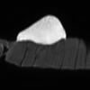
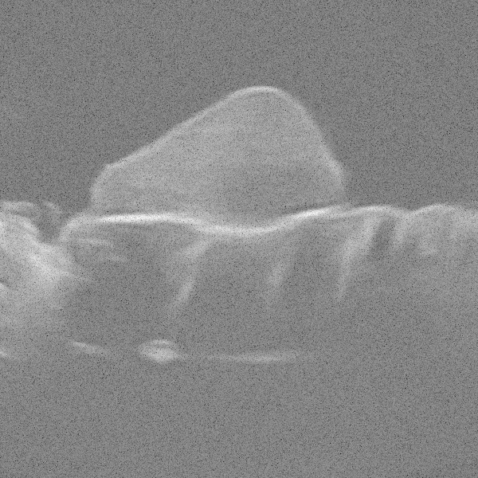
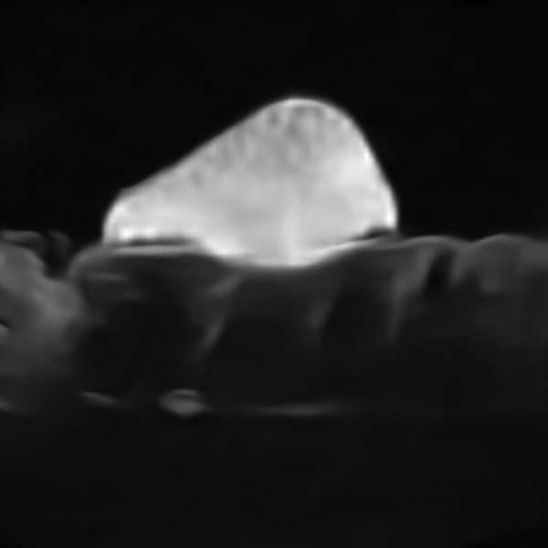
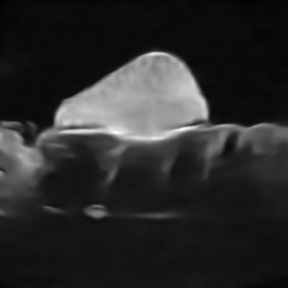
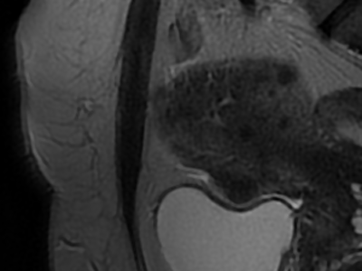
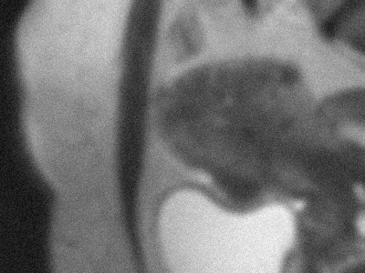
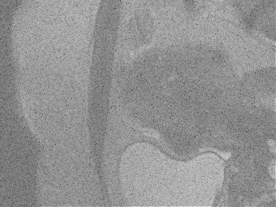
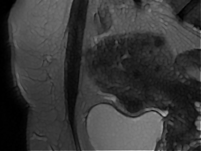
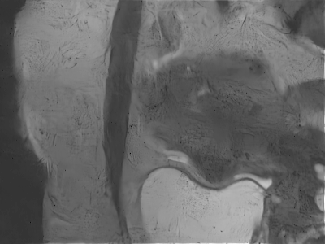
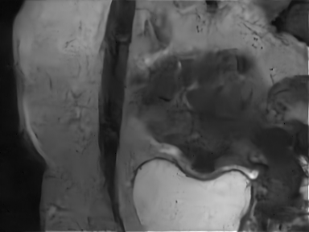

# Diffusion-Based Method for MRI–US Image Fusion

## Abstract
This repository presents two image fusion methods for Magnetic Resonance Imaging (MRI) and Ultrasound (US) images. The objective of combining these two imaging modalities is to exploit their complementary strengths, namely the high spatial resolution of US images and the high tissue contrast of MRI images, while mitigating their respective limitations: the high noise level and low contrast of US images, and the relatively low spatial resolution of MRI images.

The first method, located in the PALM-main directory, is an iterative optimization algorithm based on the PALM framework, specifically designed for MRI and US image fusion **[1]**. This implementation extends and improves a previous work, available on GitHub at: [Denoising Diffusion model with Proximal Alternating Linearized Minimization for image fusion](https://github.com/TLongin/Denoising-Diffusion-model-with-Proximal-Alternating-Linearized-Minimization) (available on the PALM directory), by providing a faithful Python translation of the original MATLAB code and introducing several new features.

The second method, located in the DDFM-PALM-main directory, is a novel MRI and US image fusion framework based on diffusion models. It was developed by drawing inspiration from the Denoising Diffusion Model for Multi-Modality Image Fusion (DDFM), introduced in **[2]**, whose official implementation is available on GitHub: [DDFM: Denoising Diffusion Model for Multi-Modality Image Fusion](https://github.com/Zhaozixiang1228/MMIF-DDFM).
The original DDFM method is a diffusion-based image fusion framework designed for infrared and visible image fusion. However, these imaging modalities differ significantly from MRI and US images. Therefore, we adapted the DDFM method to account for the specific characteristics of MRI and US modalities, notably by incorporating the PALM algorithm presented previously into the diffusion process. 
Our method is a continuation of previous work carried out within the same research group, available on GitHub at: [Denoising Diffusion model with Proximal Alternating Linearized Minimization for image fusion](https://github.com/TLongin/Denoising-Diffusion-model-with-Proximal-Alternating-Linearized-Minimization). This work aims to improve and correct the previous implementation.

## Results
We consider two datasets in our experiments. The first is a synthetic dataset, consisting of Data2 and Data3, for which ground-truth images are available. The second is a phantom dataset, referred to as Data1, for which only the observed images are available.

For more details about the synthetic datasets, please refer to the following GitHub repository: [Fusion of Magnetic Resonance and Ultrasound Images for Endometriosis Detection](https://github.com/TLongin/Fusion-of-Magnetic-Resonance-and-Ultrasound-Images-for-Endometriosis-Detection)
<h3>Data 1</h3>
<table>
  <tr>
    <td align="center">
      <br>
      <b>MRI image</b>
    </td>
    <td align="center">
      <br>
      <b>US image</b>
    </td>
  </tr>
</table>

<h4>Fused images : Data 1</h4>
<table>
  <tr>
    <td align="center">
      <br>
      <b>PALM method</b>
    </td>
    <td align="center">
      <br>
      <b>DDFM-PALM method</b>
    </td>
  </tr>
</table>

<h3> Data 3</h3>
<table>
  <tr>
    <td align="center">
      <br>
      <b>MRI Ground Truth</b>
    </td>
    <td align="center">
      <br>
      <b>MRI Observed</b>
    </td>
    <td align="center">
      <br>
      <b>US Observed</b>
    </td>
    <td align="center">
      <br>
      <b>US Ground Truth</b>
    </td>
  </tr>
</table>

<h4>Fused images : Data 3</h4>

<table>
  <tr>
    <td align="center">
      <br>
      <b>PALM method</b>
    </td>
    <td align="center">
      <br>
      <b>DDFM-PALM method</b>
    </td>
  </tr>
</table>

#### Quantitative Results

| Metrics | PALM with US GT | PALM with IRM GT | Our Method with US GT | Our Method with IRM GT |
|:--------|-----------:|------------:|-----------:|------------:|
| RMSE ↓  | 26.97837 | 17.23969 |  **26.17978** | **12.79862** |
| PSNR ↑  | 19.51049 | 23.40021 |  **19.77152** | **25.98754** |
| SSIM ↑  | 0.65687 | 0.63748 |  **0.74476** | **0.70930** |

## Usage
### 1. Installation Procedure
We recommend following the instructions provided in the Github repository Denoising Diffusion Model for Multi-Modality Image fusion, as the original code (which we modified for our needs) comes from there [2]. Follow the instructions provided with the files given in our repository. Please note that we used Python version 3.12 and not 3.8. It is advisable to install the packages listed in the Github repository (requirement.txt file) one by one and not all at once with the command indicated :
```python
pip install requirements.txt
```
without specifying the version so that any dependency issues between different packages are automatically resolved. This process is long and tedious, but it is the only way to ensure that all of the packages have the correct versions, without dependency issues.
Please do not forget to download the checkpoint "256x256_diffusion_uncond.pt" available at [this link](https://github.com/openai/guided-diffusion)  and place it in the `./DDFM-PALM-main/models/` directory. 

### 2. Inference with DDFM-PALM

To perform inference with our DDFM-PALM method, navigate to the DDFM-PALM-main directory and run the appropriate script depending on the dimensions of the input data.

#### Data with the same dimensions
For input data with the same dimensions, run:
```python
python sampleTLSE_unidim.py
```
Before running the script, make sure that the following import is uncommented in `./DDFM-PALM-main/guided_diffusion/gaussian_diffusion.py`: 
```python
from .PALM_DDFM_unidim import fusion_onestep
#from .PALM_DDFM import fusion_onestep
```
#### Data with different dimensions
For input data with different dimensions, run:
```python
python sampleTLSE.py
```
In this case, make sure that the following import is uncommented in `./DDFM-PALM-main/guided_diffusion/gaussian_diffusion.py`:
```python
# from .PALM_DDFM_unidim import fusion_onestep
from .PALM_DDFM import fusion_onestep
```

Then, the fused results will be saved in the `./DDFM-PALM-main/output/recon/` folder.

### 2. Inference PALM
To perform inference with PALM method, navigate to the PALM-main directory and run the appropriate script depending on the dimensions of the input data:
```python
python palm_main.py
```
```python
python palm_main_unidim.py
```


## References
**[1]** Oumaima El Mansouri, Fabien Vidal, Adrian Basarab, Pierre Payoux, Denis Kouamé, and Jean-Yves Tourneret. Fusion of magnetic resonance and ultrasound images for endometriosis detection. IEEE Transactions on Image Processing, 2020.

**[2]** Zixiang Zhao, Haowen Bai, Yuanzhi Zhu, Jiangshe Zhang, Shuang Xu, Yulun Zhang, Kai Zhang, Deyu Meng, Radu Timofte, and Luc Van Gool. Ddfm : Denoising diffusion model for multi-modality image fusion, 2023. 


If you use this code, please cite:

```bibtex
@article{9018380,
  author={El Mansouri, Oumaima and Vidal, Fabien and Basarab, Adrian and Payoux, Pierre and Kouamé, Denis and Tourneret, Jean-Yves},
  journal={IEEE Transactions on Image Processing},
  title={Fusion of Magnetic Resonance and Ultrasound Images for Endometriosis Detection}, 
  year={2020},
  volume={29},
  number={},
  pages={5324-5335},
  keywords={Spatial resolution;Magnetic resonance imaging;Image fusion;Diseases;Magnetic resonance;Image fusion;magnetic resonance imaging;ultrasound imaging;super-resolution;despeckling;proximal alternating linearized minimization},
  doi={10.1109/TIP.2020.2975977}
}

@InProceedings{Zhao_2023_ICCV,
  author    = {Zhao, Zixiang and Bai, Haowen and Zhu, Yuanzhi and Zhang, Jiangshe and Xu, Shuang and Zhang, Yulun and Zhang, Kai and Meng, Deyu and Timofte, Radu and Van Gool, Luc},
  title     = {DDFM: Denoising Diffusion Model for Multi-Modality Image Fusion},
  booktitle = {Proceedings of the IEEE/CVF International Conference on Computer Vision (ICCV)},
  month     = {October},
  year      = {2023},
  pages     = {8082-8093}
}
```


